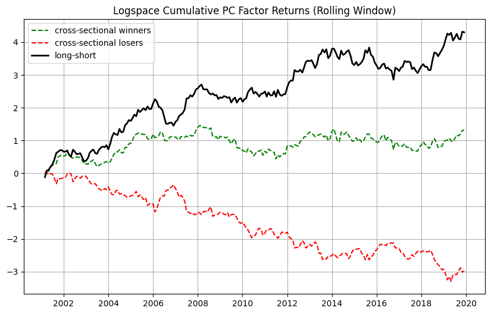

# Factor Momentum
Testing whether factor-level mispricings persist due to slow diffusion from residual arbitrageurs

### Overview
This project explores factor momentum: the tendency for factor premia (e.g., value, momentum, quality) to exhibit persistence over time.

The working theory: mispricings at the factor level persist because information diffuses slowly among residual arbitrageurs, leading to predictable return continuation. Because factor momentum is truley systemic, the momentum effect resides only in the principal components of factors that explain the most variance of their returns.

This project was developed as part of the BYU Silver Fund, one of the nation’s oldest student-run investment funds.

### Methodology
**Signal Construction** 
  
  Principal Components are extracted from a 100-day rolling window using all of Barras style-factor returns (excluding momentum and reversal). 

  We keep the top 5 PCs with the highest eigen values, as the factor momentum effect collects there. The rest of the PCs do not have a strong momentum effect and only add noise.
  
  We then compute the 1-month cross sectional signal for PC returns (monthly frequency):

 $$
  \text{signal}_{pc,i,t} =
  \begin{cases}
  1,  & \text{if } r_{i,t-1} > \mathrm{median}(r_{t-1}) \\
  0,  & \text{if } r_{i,t-1} = \mathrm{median}(r_{t-1}) \\
  -1, & \text{if } r_{i,t-1} < \mathrm{median}(r_{t-1})
  \end{cases}
  $$

**Universe Filtering** 

Uses all equities in the Russel 3000 universe.

 

 
### Results

Logspace Returns of the Top 5 Principal Compenents grouped as Winners/Losers (and Spread Portfolio)

**Rolling Window PCA**

**FF5 + UMD Regression (Spread Portfolio Excess Returns)**

| Factor | Coefficient | t-Stat | Significance |
|--------|-------------|--------|--------------|
| Alpha  | 0.018       | 2.56   | **           |
| MKT    | -0.196      | -0.99  |              |
| SMB    | 0.295       | 1.04   |              |
| RMW    | -0.444      | -1.16  |              |
| CMA    | -0.815      | -2.01  | *            |
| UMD    | 0.151       | 0.93   |              |

This uses a rolling PCA, fitted to daily (t-lookback_window to t-1), with the PCs recalculated monthly. The lookback window for PCA fitting here is 100 days.

### Questions / Needs Further Exploration

1. Are these 5 PC's the same across time? -> Run autocorrelation tests on PC loadings across time.

2. If they are stable, what do each of these PC's represent/capture? Look at turnover and singal distribution for each PC.

### Teck Stack

