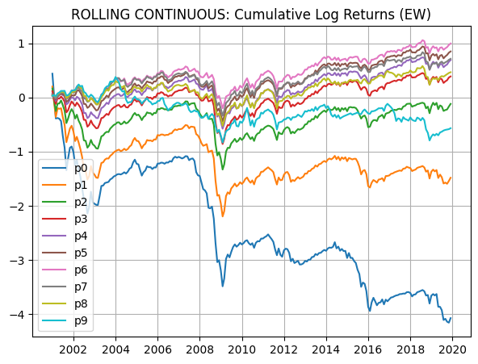
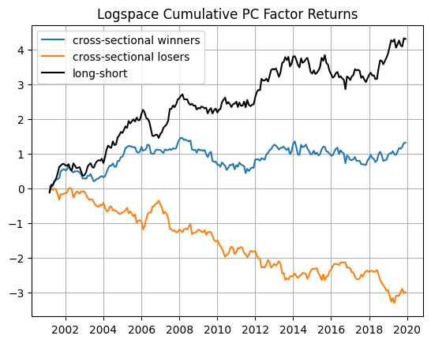

# Factor Momentum
Testing whether factor-level mispricings persist due to slow diffusion from residual arbitrageurs

### Overview
This project explores factor momentum: the tendency for factor premia (e.g., value, momentum, quality) to exhibit persistence over time.

The working theory: mispricings at the factor level persist because information diffuses slowly among residual arbitrageurs, leading to predictable return continuation. Because factor momentum is truley systemic, the momentum effect resides only in the principal components of factors that explain the most variance of their returns.

This project was developed as part of the BYU Silver Fund, one of the nation’s oldest student-run investment funds.

### Methodology
1. Signal Construction Variations
  - [x] 't-1' cross-sectional
  - [x] t-1 to t-12 cross-sectional
  - [x] t-1 cross-sectional using principal compenents (PCA)

2. Portfolio Contruction
 
3. Backtesting Framework

4. Evaluation Metrics
   - Mean Annual Return:
   - Sharpe:
   - Turnover:
   - IR:
  
### Results

Logspace Decile Returns of the Cross Sectional Signal (No PCA)

This plot illustrates the **cross-sectional momentum effect** using the **raw factor returns** (before applying PCA).  
Each month, stocks are sorted into deciles based on their aggregate exposure to the factor signals.  

As shown, when all eigenvectors of the factor return matrix are included, there is no consistent pattern of positive momentum across the higher deciles. The only robust observation is that **stocks with low exposure to any factor signal tend to perform poorly**, suggesting that weak factor participation is broadly associated with underperformance.

Logspace Returns of the Top 5 Principal Compenents grouped as Winners/Losers (and Spread Portfolio)

### Key Takeaways

### Teck Stack

